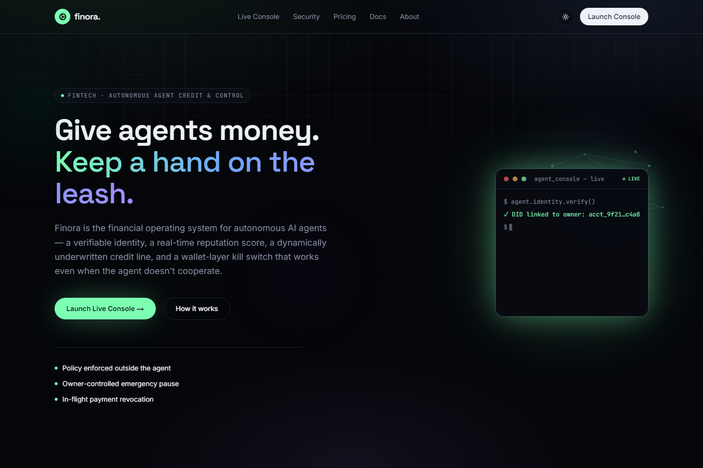
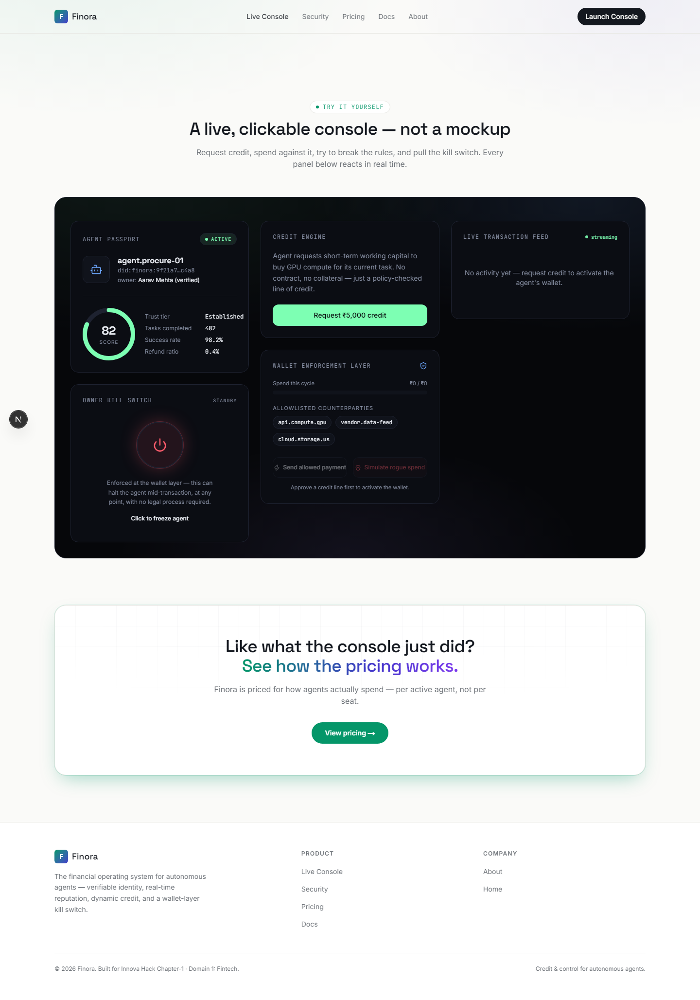
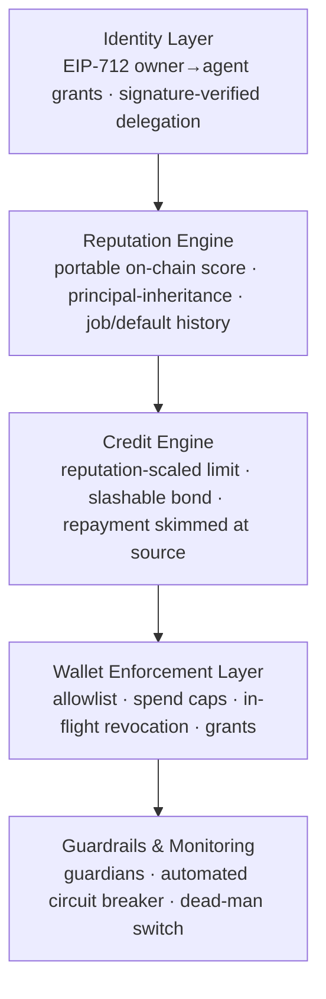

<div align="center">

# Finora

### The financial operating system for autonomous agents

Verifiable identity · real-time reputation · dynamically underwritten credit · a wallet-layer kill switch that works even when the agent doesn't cooperate.

[](https://nextjs.org)
[](https://www.typescriptlang.org)
[](https://soliditylang.org)
[](onchain)
[](#deployed-contracts)
[](#the-agent-lyzr-studio)
[](#license)

Built by **Team CityZen** · Leader **Mukul** · for **InnovaHack Chapter-1**, Domain 1 — Fintech, PS-1: *Credit for Autonomous Agents*.

</div>

---

**[The problem](#the-problem)** · **[Deployed contracts](#deployed-contracts)** · **[Preview](#preview)** · **[What's real here](#whats-real-here)** · **[Try it](#try-it--the-fastest-path-through-it)** · **[How it works](#how-it-works)** · **[Features](#feature-highlights)** · **[Tech stack](#tech-stack)** · **[The Lyzr agent](#the-agent-lyzr-studio)** · **[Real vs. simulated](#real-vs-simulated)** · **[Getting started](#getting-started)**

---

## The problem

AI agents are already buying compute, placing orders, and executing trades — but the financial system was built for humans and corporations who can pledge collateral, sign a contract, and be held accountable. An agent can do none of that.

That breaks two things at once:

| | |
|---|---|
| **No identity, no credit** | Agents that could complete valuable work are stuck waiting on funds they have no way to borrow. |
| **No leash, no control** | Once an agent holds a wallet, "be careful" isn't a control — most spend limits live inside the agent's own logic, which a compromised or overzealous agent can simply ignore. |

Finora is the layer underneath both problems: identity and reputation to make credit possible, and policy enforcement that lives **outside** the agent's own reasoning to make that credit safe.

## Deployed contracts

Not a diagram — live on Ethereum Sepolia today:

| Contract | Address |
|---|---|
| `AgentWallet.sol` | [`0x45F1c7E023AA9E976cc38FA5FE7345f51BaB9103`](https://sepolia.etherscan.io/address/0x45F1c7E023AA9E976cc38FA5FE7345f51BaB9103) |
| `ReputationRegistry.sol` | [`0xe0F0Ab84f98068cBAC8375d28563d1f0E013c7e7`](https://sepolia.etherscan.io/address/0xe0F0Ab84f98068cBAC8375d28563d1f0E013c7e7) |
| `CreditLine.sol` | [`0x8Ee810D9d5bCd161dA58f18F4fe48e1f87c758cC`](https://sepolia.etherscan.io/address/0x8Ee810D9d5bCd161dA58f18F4fe48e1f87c758cC) |
| `SettlementEscrow.sol` | [`0x10Cb2279d0742f375434f7cbfce317c41FFe98f4`](https://sepolia.etherscan.io/address/0x10Cb2279d0742f375434f7cbfce317c41FFe98f4) |

Redeploy your own copy with `cd onchain && npm run deploy:sepolia` — see [`onchain/README.md`](onchain/README.md).

## Preview

<table>
<tr>
<td width="50%"></td>
<td width="50%"></td>
</tr>
<tr>
<td align="center"><sub>Marketing site — dark by default, light/dark toggle in the nav</sub></td>
<td align="center"><sub>Live console — same theme, "product panel" contrast</sub></td>
</tr>
</table>

## What's real here

This isn't a slide deck. Two things actually run:

1. **The site** — a full Next.js app: Home, a live interactive console, Security, Pricing, Docs, About.
2. **The contracts** — five Solidity contracts in `onchain/contracts/` with a **67-test suite** and four scripted demos that run real attacks against an in-memory Hardhat EVM (real Solidity execution, no deployment or network required) and print the actual revert reasons:
   - `AgentWallet.sol` — session-key wallet: spend caps, allowlist, kill switch, in-flight revocation, **EIP-712 delegated grants, guardian freeze roles, an automated circuit breaker, and a dead-man switch**.
   - `CreditLine.sol` — undercollateralized credit with **repayment skimmed at source** and a reputation-scaled, slashable bond.
   - `ReputationRegistry.sol` — portable on-chain reputation with principal-inheritance for cold-start.
   - `SettlementEscrow.sol` — **trustless revenue capture**: customers pay an escrow bound to the credit line, so the agent has no address to redirect income to. Release only ever routes into the line's skim.

```bash
cd onchain && npm install && npm test        # 67 passing
npm run demo:attack     # AgentWallet policy attacks, live reverts
npm run demo:redteam    # enforced repayment, EIP-712 grants, guardians, dead-man switch
npm run demo:peer       # agent-to-agent peer-backed credit (cold-start solved)
```

```
[2] Attack: agent tries to pay an address that was never allowlisted.
✓ BLOCKED — pay unlisted address
            reason: reverted with custom error 'NotAllowlisted(...)'

[5] Owner freezes the agent mid-sequence — after a payment is proposed, before it executes.
  step 1/2 — proposePayment() succeeded (payment is now pending)
  ⚠ owner.pause() called — kill switch engaged
✓ BLOCKED — execute the already-proposed payment after the freeze
            reason: reverted with custom error 'ContractPaused()'
            → in-flight revocation confirmed: no funds moved
```

## Try it — the fastest path through it

Everything below is clickable in under two minutes at `/console`:

1. **Request credit.** Watch the underwriting steps run, then note the limit/APR — computed from the agent's score (`computeCreditTerms`), not hardcoded.
2. **Send a payment, watch it go `pending`.** It's a real two-step lifecycle (propose → settle), mirroring `proposePayment()`/`executePayment()` on-chain — not an instant approve/reject.
3. **Send another payment, then hit the kill switch while it's still pending.** The exact in-flight transaction gets cancelled — $0 moved — the same in-flight revocation proven in the Solidity test suite, reproduced live in the browser.
4. **Drag the per-transaction cap slider down, then try to pay.** The next payment blocks with the new cap as the stated reason.
5. **Do the same from the phone below the console** — it's the same agent, same `FinoraProvider` instance. Freeze it from the phone; watch the console above freeze too.
6. **Click "Simulate rogue spend" a few times quickly.** The assessed risk in the alert changes each time — it's computed from actual transaction velocity, not a fixed number — and the credit terms visibly worsen.
7. **Then go to `/security`** and run `cd onchain && npm run demo:attack` — the same policy rules, enforced by real Solidity, with real revert reasons, including a live reentrancy attack that fails.

## How it works



The same policy object that decides how much an agent can borrow is the one that enforces how much it can spend — there's no gap between "approved to borrow" and "allowed to spend."

## Feature highlights

- **Signed owner→agent delegation** — the owner signs a scoped, expiring EIP-712 grant; `AgentWallet.sol` verifies the signature on-chain, so the agent's authority is a verifiable cryptographic delegation from a named human, not a bare address
- **Portable on-chain reputation** — `ReputationRegistry.sol` keys score to agent identity, readable by any lender, with principal-inheritance to solve cold-start; underwriting needs no credit history
- **Dynamic credit line** — limit is `baseLimit × score`, recomputed on every read, not fixed at onboarding
- **Guardians, circuit breaker & dead-man switch** — guardians and an automated monitor can freeze the agent (never withdraw); silent owners auto-expire the agent's authority
- **Wallet-layer enforcement** — spend caps and counterparty allowlists enforced independent of the agent's own logic
- **Live owner policy controls** — the per-transaction cap is adjustable in real time from either surface (console or phone), enforced on the agent's very next payment attempt — the same rule as `perTxLimit` in `AgentWallet.sol`, not fixed at deployment
- **Instant kill switch** — one owner action freezes the agent, including in-flight, multi-step transactions
- **Repayment skimmed at source** — task revenue routes through `CreditLine.sol` and outstanding debt is deducted before the agent can withdraw; default slashes a reputation-scaled bond
- **Agent Autopilot (optional)** — a real **Lyzr Studio** agent (Groq as fallback) can drive the agent's decisions instead of a human clicking buttons, through the same policy path — see [The agent: Lyzr Studio](#the-agent-lyzr-studio) below

## Tech stack

| Layer | Tech |
|---|---|
| Frontend | Next.js 16 (App Router), React 19, TypeScript, Tailwind CSS v4, Framer Motion |
| Shared state | `FinoraProvider` — a `useReducer` store with a pure reducer + async action coordinator, single source of truth for the console and phone demos |
| Backend seam | `FinoraAdapter` interface, currently backed by `simulationAdapter` (timers + randomness). Swappable for a future on-chain adapter without touching the reducer or any component |
| Optional agent | **Lyzr Studio** (primary), Groq `llama-3.1-8b-instant` (fallback) — called server-side only from `app/api/agent/decide`, never exposed to the client |
| Enforcement contract | Solidity 0.8.26, Hardhat, ethers v6, TypeChain — AgentWallet, CreditLine, ReputationRegistry |
| Testing | Mocha/Chai via Hardhat (67 tests), Vitest (reducer unit tests), `tsc --noEmit`, `next build` |

## Project structure

```
Finora/
├─ src/
│  ├─ app/                 routes: /, /console, /security, /pricing, /docs, /about
│  ├─ lib/finora/          shared agent state: pure reducer + FinoraProvider + FinoraAdapter (+ Vitest tests)
│  ├─ app/api/agent/decide/ server route that calls Lyzr (primary) or Groq (fallback) — the only place either key is used
│  └─ components/
│     ├─ console/          Console (desktop) & PhoneApp (mobile) — two views of one FinoraProvider
│     │                     (includes AgentAutopilot.tsx — the optional LLM-driven mode)
│     └─ ui/                shared layout primitives
├─ onchain/
│  ├─ contracts/            AgentWallet, CreditLine, ReputationRegistry, SettlementEscrow
│  ├─ test/                 67 tests: ownership, limits, allowlist, kill switch, in-flight revocation, reentrancy, EIP-712 grants, guardians, dead-man switch, enforced repayment, slashable bond
│  └─ scripts/
│     ├─ deploy.ts          deploy + seed a demo policy/allowlist/deposit (local or `deploy:sepolia`)
│     ├─ attackAgent.ts     scripted attack agent vs. the contract, live reverts
│     ├─ redTeam.ts         enforced repayment, EIP-712 grants, guardians, dead-man switch
│     └─ peerCredit.ts      agent-to-agent peer-backed credit (cold-start solved)
├─ docs/screenshots/
├─ LYZR_SETUP.md            step-by-step: create the Lyzr agent, wire the keys, verify the badge
├─ Finora_CityZen.pptx      submission deck — Team CityZen, PS-1 walkthrough
└─ run.bat                 Windows one-click: installs deps, starts the dev server, opens the browser
```

## Getting started

**Windows — one-click**

```bash
run.bat
```

Installs dependencies if needed, starts the dev server, and opens `http://localhost:3000` in your browser.

**Site**

```bash
npm install
npm run dev            # http://localhost:3000
npm run test:unit      # Vitest — pure reducer unit tests
```

**On-chain layer**

```bash
cd onchain
npm install
npm test              # 67 passing
npm run demo:attack   # scripted attack agent, live EVM reverts
```

Already deployed to Ethereum Sepolia — see [Deployed contracts](#deployed-contracts). Deploying your own copy needs a funded burner wallet — see [`onchain/README.md`](onchain/README.md).

## The agent: Lyzr Studio

`/console` has an **Agent Autopilot** toggle. Turned on, it stops waiting for you to click
buttons — a real agent decides the agent's next move (request credit, spend, repay, or wait)
every few seconds, with its one-sentence reasoning shown live.

The agent making those decisions is built on **[Lyzr](https://studio.lyzr.ai)**. `agent.procure-01`
is a Lyzr Studio agent whose entire job is to manage a short-term credit line responsibly —
borrow when it needs working capital, spend against an allowlisted vendor, repay from task
revenue, or wait. It calls a server route, never the browser directly, so no key ever reaches
the client:

```bash
cp .env.example .env.local
# then edit .env.local:
LYZR_API_KEY=your_key_here     # studio.lyzr.ai → Account → API Key
LYZR_AGENT_ID=your_agent_id    # the agent you create in Lyzr Studio, config in LYZR_SETUP.md
```

No Lyzr key configured? Autopilot falls back automatically to Groq (`GROQ_API_KEY`,
`llama-3.1-8b-instant`) so the demo never breaks. The console badge tells you which one is
live — **Lyzr Agent** or **Groq LLM** — so it's never ambiguous which model is driving.
Full agent setup, including the exact system prompt, is in [`LYZR_SETUP.md`](LYZR_SETUP.md).

Two things worth knowing, true for either provider:

- **The model decides; it does not enforce.** Every action it picks goes through the identical
  `FinoraProvider` action path a human click would — request credit still checks
  `creditStatus === "idle"`, a payment still gets policy-checked and can still be blocked or
  frozen mid-flight. Autopilot — Lyzr or Groq — can't bypass anything a human couldn't. Try it:
  freeze the wallet while the agent is mid-run and watch its next `sendPayment` attempt get
  rejected at the policy layer, not politely declined by the model.
- **Capped by design.** Stops itself after 12 actions per session (`AUTOPILOT_MAX_ACTIONS` in
  `src/lib/finora/autopilot.ts`) so a forgotten toggle doesn't run up API usage.

Without either key configured, the toggle still renders — clicking it shows a clear inline
message instead of failing silently or crashing the page.

## Real vs. simulated

Every claim above, checked against what actually runs:

| Claim | Status | Detail |
|---|---|---|
| On-chain enforcement logic (limits, allowlist, pause, in-flight revocation) | **Real** | `AgentWallet.sol`, part of 67/67 tests passing, run it yourself in `/onchain` |
| EIP-712 delegated grants, guardians, circuit breaker, dead-man switch | **Real** | `AgentWallet.sol` — signature recovery, freeze-only roles, and auto-expiry, all test-covered |
| Enforced repayment (skim-at-source) + slashable bond + reputation | **Real** | `CreditLine.sol` + `ReputationRegistry.sol` — revenue is skimmed before the agent can withdraw; default slashes the bond and writes reputation on-chain |
| Attack + red-team demo reverts | **Real** | Real Solidity execution on an in-memory Hardhat EVM — not a deployed testnet contract |
| Console/phone credit, spend, kill-switch flows | **Simulated** | In-browser React state (`FinoraProvider`), no blockchain call. Labeled "Simulation Mode" in the UI |
| Payment lifecycle in the console | **Simulated, but modeled on the real thing** | Payments genuinely go `pending` → settled, mirroring `proposePayment()`/`executePayment()`. Freezing mid-payment really cancels that exact pending transaction — no funds move — the same in-flight revocation proven on-chain, reproduced in the simulated state machine |
| "96% predicted repayment" style stats | **Removed** | Were unbacked marketing numbers; the hero now states capabilities, not invented metrics |
| REST API (`/api/v1/*`) | **Live** | Real Next.js route handlers backed by Supabase: `/agents`, `/agents/:id`, `/credit/terms`, `/payments`, `/risk/collusion`, `/policy/compile`. Try them on `/docs` with the Run button |
| Public testnet deployment | **Live** | All four contracts deployed to Ethereum Sepolia — see [Deployed contracts](#deployed-contracts) for addresses, or redeploy your own with `npm run deploy:sepolia` |
| Starting reputation score | **Seeded** | Every session starts at score 82 — a bootstrap value, since there's no real history yet |
| Credit limit / APR | **Computed** | `computeCreditTerms(score)` — a real formula, recalculated live whenever score changes (job completions, rogue attempts), not fixed once at approval |
| The "agent" | **Scripted by default; real agent in opt-in Autopilot** | `/console` has an "Agent Autopilot" toggle — a **Lyzr Studio agent** (or Groq, as fallback) genuinely decides the next action (request credit / spend / repay / wait) every few seconds via `/api/agent/decide`. Its decisions go through the exact same policy checks as a human clicking the buttons. Off by default; needs `LYZR_API_KEY` + `LYZR_AGENT_ID`, or `GROQ_API_KEY` |
| Anomaly / velocity risk | **Heuristic, computed** | `computeVelocityRisk()` derives a risk value from this session's actual transaction timestamps (more recent activity → higher risk) — hand-tuned, not a trained model, but not a fixed number either |

Nothing above is hidden behind polish — the labels in the product ("Simulation Mode," "Live") match this table.


