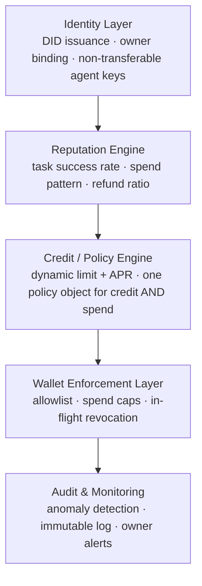

<div align="center">

# Finora

### The financial operating system for autonomous agents

Verifiable identity · real-time reputation · dynamically underwritten credit · a wallet-layer kill switch that works even when the agent doesn't cooperate.

[](https://nextjs.org)
[](https://www.typescriptlang.org)
[](https://soliditylang.org)
[](onchain)
[](#license)

Built for **Innova Hack Chapter-1**, Domain 1 — Fintech.

</div>

---

## The problem

AI agents are already buying compute, placing orders, and executing trades — but the financial system was built for humans and corporations who can pledge collateral, sign a contract, and be held accountable. An agent can do none of that.

That breaks two things at once:

| | |
|---|---|
| **No identity, no credit** | Agents that could complete valuable work are stuck waiting on funds they have no way to borrow. |
| **No leash, no control** | Once an agent holds a wallet, "be careful" isn't a control — most spend limits live inside the agent's own logic, which a compromised or overzealous agent can simply ignore. |

Finora is the layer underneath both problems: identity and reputation to make credit possible, and policy enforcement that lives **outside** the agent's own reasoning to make that credit safe.

## Preview

<table>
<tr>
<td width="50%"></td>
<td width="50%"></td>
</tr>
<tr>
<td align="center"><sub>Marketing site — light, premium theme</sub></td>
<td align="center"><sub>Live console — dark "product panel" contrast</sub></td>
</tr>
</table>

## What's real here

This isn't a slide deck. Two things actually run:

1. **The site** — a full Next.js app: Home, a live interactive console, Security, Pricing, Docs, About.
2. **The contract** — `onchain/contracts/AgentWallet.sol`, a Solidity session-key wallet with a 24-test suite and a scripted attack-agent demo that runs real attacks against an in-memory Hardhat EVM (real Solidity execution, no deployment or network required) and prints the actual revert reasons.

```bash
cd onchain && npm install && npm run demo:attack
```

```
[2] Attack: agent tries to pay an address that was never allowlisted.
✓ BLOCKED — pay unlisted address
            reason: reverted with custom error 'NotAllowlisted(...)'

[5] Owner freezes the agent mid-sequence — after a payment is proposed, before it executes.
  step 1/2 — proposePayment() succeeded (payment is now pending)
  ⚠ owner.pause() called — kill switch engaged
✓ BLOCKED — execute the already-proposed payment after the freeze
            reason: reverted with custom error 'ContractPaused()'
            → in-flight revocation confirmed: no funds moved
```

## How it works



The same policy object that decides how much an agent can borrow is the one that enforces how much it can spend — there's no gap between "approved to borrow" and "allowed to spend."

## Feature highlights

- **Agent identity (DID)** — a verifiable, non-transferable link between an agent and the human or org that authorized it
- **Reputation engine** — underwriting from task success rate, spend discipline, and refund ratio, with no credit history required
- **Dynamic credit line** — limit and APR recalculated in real time, not fixed at onboarding
- **Wallet-layer enforcement** — spend caps and counterparty allowlists enforced independent of the agent's own logic
- **Instant kill switch** — one owner action freezes the agent, including in-flight, multi-step transactions
- **Programmatic auto-repayment** — loan balance is deducted automatically when a task's revenue lands

## Tech stack

| Layer | Tech |
|---|---|
| Frontend | Next.js 16 (App Router), React 19, TypeScript, Tailwind CSS v4, Framer Motion |
| Shared state | `FinoraProvider` — a `useReducer` store with a pure reducer + async action coordinator, single source of truth for the console and phone demos |
| Backend seam | `FinoraAdapter` interface, currently backed by `simulationAdapter` (timers + randomness). Swappable for a future on-chain adapter without touching the reducer or any component |
| Enforcement contract | Solidity 0.8.24, Hardhat, ethers v6, TypeChain |
| Testing | Mocha/Chai via Hardhat (24 tests), Vitest (reducer unit tests), `tsc --noEmit`, `next build` |

## Project structure

```
Finora/
├─ src/
│  ├─ app/                 routes: /, /console, /security, /pricing, /docs, /about
│  ├─ lib/finora/          shared agent state: pure reducer + FinoraProvider + FinoraAdapter (+ Vitest tests)
│  └─ components/
│     ├─ console/          Console (desktop) & PhoneApp (mobile) — two views of one FinoraProvider
│     └─ ui/                shared layout primitives
├─ onchain/
│  ├─ contracts/AgentWallet.sol
│  ├─ test/AgentWallet.test.ts       24 tests: ownership transfer, limits, allowlist, kill switch, in-flight revocation, reentrancy guard
│  └─ scripts/
│     ├─ deploy.ts          deploy + seed a demo policy/allowlist/deposit
│     └─ attackAgent.ts     scripted attack agent vs. the contract, live reverts
└─ docs/screenshots/
```

## Getting started

**Site**

```bash
npm install
npm run dev            # http://localhost:3000
npm run test:unit      # Vitest — pure reducer unit tests
```

**On-chain layer**

```bash
cd onchain
npm install
npm test              # 24 passing
npm run demo:attack   # scripted attack agent, live EVM reverts
```

Deploying to a public testnet (Base Sepolia) needs a funded burner wallet — see [`onchain/README.md`](onchain/README.md).

## Real vs. simulated

Every claim above, checked against what actually runs:

| Claim | Status | Detail |
|---|---|---|
| On-chain enforcement logic (limits, allowlist, pause, in-flight revocation) | **Real** | `AgentWallet.sol`, 24/24 tests passing, run it yourself in `/onchain` |
| Attack demo reverts | **Real** | Real Solidity execution on an in-memory Hardhat EVM — not a deployed testnet contract |
| Console/phone credit, spend, kill-switch flows | **Simulated** | In-browser React state (`FinoraProvider`), no blockchain call. Labeled "Simulation Mode" in the UI |
| "96% predicted repayment" style stats | **Removed** | Were unbacked marketing numbers; the hero now states capabilities, not invented metrics |
| REST API (`/docs`) | **Not live** | Describes the planned API shape; `api.finora.dev` does not resolve |
| Public testnet deployment | **Not deployed** | Deliberate choice, to keep the demo reliable during judging — see `onchain/README.md` for how to deploy it |
| Reputation score / underwriting numbers | **Hardcoded** | Fixed demo values (e.g. score 82, ₹8,200 @ 14.2%), not calculated from real signals |
| The "agent" | **Scripted** | State-driven UI logic, not a tool-calling LLM |
| Anomaly detection | **Fixed adjustment** | A hardcoded score delta on the rogue-spend demo action, not a trained model |

Nothing above is hidden behind polish — the labels in the product ("Simulation Mode," "Planned API — Not Currently Live") match this table.

## License

MIT
